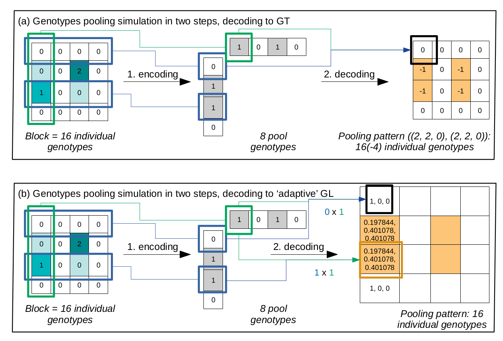

# VCFPooling

## Description
This project implements SNP genotypes pooling simulation in the [DNA Sudoku style by Y. Erlich](https://www.ncbi.nlm.nih.gov/pmc/articles/PMC2704425/pdf/1243.pdf/?tool=EBI).
The block size chosen for the pooling design is 4*4, with 8 pools and a design weight of 2.
The encoding and decoding part of the pooling procedure can be represented as follows: 
where {0, 1, 2, -1} are the allelic dosages from the true genotypes values at one SNP of any sample in (a). {0, 1, 2, -1} stand for 
homozygote reference allele, heterozygote, homozygote alternate allele, missing genotype.

We implemented a refined version of decoding where the missing true genotypes are converted to genotype probabilities 
depending on the position of the sample in the block layout _lambda_ and the pooling pattern _psi_. In the above picture (b),
_lambda_= (0, 2, 1, 0) e.g. allelic dosages of the ambiguous samples after pooling, 
and _psi_=((2, 2, 0), (2, 2, 0)) is the pooling pattern e.g. 2 row-pools have genotype 0, 2 have genotype 1, none has genotype 2, idem for the column-pools.

## Usage
Some data and scripts are provided as usage examples in [/examples](/examples). 

## References
* https://www.ncbi.nlm.nih.gov/pmc/articles/PMC2704425/pdf/1243.pdf/?tool=EBI
